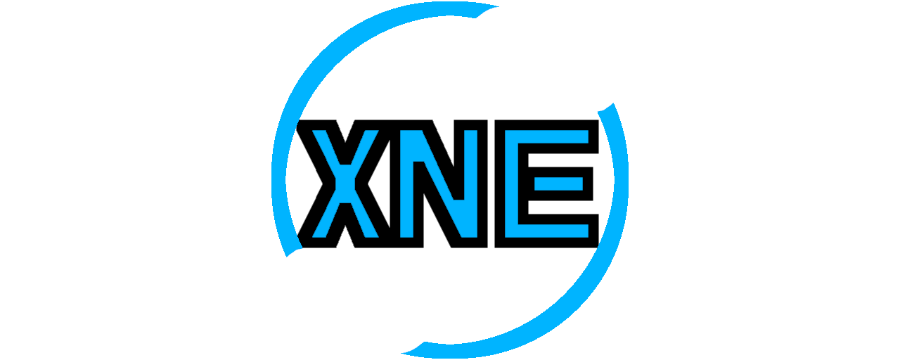

# XNBTEdit. Edit NBT in XML


NBT-XML converter. Also capable of editing.
## Features
* NBT -> XML and back
* Easy editing in XML (similar to HTML)
* Text editor of your choice
* Ability to only convert a file
* SNBTs are also parsed. No more scary inline tags!
* Bulk editing/conversion
*There may be issues with non-ASCII characters. Gonna implement, later.*

**WARNING. Manually editing NBT files is not safe. So be sure you know what you\'re doing. Or, at least, create a backup. If you didn\'t and something went wrong, you can try to load the previous version saved in the same folder with .backup extension.**

Before:
```h
0a00 0001 000b 7365 656e 4372 6564 6974
7300 0200 0944 6561 7468 5469 6d65 0000
0300 0d66 6f6f 6454 6963 6b54 696d 6572
0000 0000 0a00 0a72 6563 6970 6542 6f6f
6b09 0007 7265 6369 7065 7308 0000 0003
0014 6165 3277 746c 6962 3a6d 6167 6e65
745f 6361 7264 0035 6165 3277 746c 6962
3a77 6972 656c 6573 735f 756e 6976 6572
...
```
After:
```xml
<?xml version="1.0"?>
<compound>
	<byte name="seenCredits">false</byte>
	<short name="DeathTime">0</short>
	<int name="foodTickTimer">0</int>
	<compound name="recipeBook">
		<list of="string" name="recipes">
			<string>ae2wtlib:magnet_card</string>
			<string>ae2wtlib:wireless_universal_terminal/upgrade_crafting</string>
			<string>ae2wtlib:infinity_booster_card</string>
		</list>
		<byte name="isGuiOpen">false</byte>
		<list of="string" name="toBeDisplayed">
			<string>ae2wtlib:magnet_card</string>
			<string>ae2wtlib:wireless_universal_terminal/upgrade_crafting</string>
			<string>ae2wtlib:infinity_booster_card</string>
		</list>
		<byte name="isSmokerGuiOpen">false</byte>
		<byte name="isFurnaceFilteringCraftable">false</byte>
		<byte name="isFurnaceGuiOpen">false</byte>
		<byte name="isBlastingFurnaceFilteringCraftable">false</byte>
		<byte name="isBlastingFurnaceGuiOpen">false</byte>
		<byte name="isFilteringCraftable">false</byte>
		<byte name="isSmokerFilteringCraftable">false</byte>
	</compound>
	<int name="XpTotal">0</int>
	<byte name="OnGround">true</byte>
	<float name="AbsorptionAmount">0</float>
	<int name="playerGameType">1</int>
	<compound name="TenshiLib:Patreon">
		<int name="Color">0</int>
		<byte name="ShouldRender">true</byte>
		<int name="Location">2</int>
	</compound>
	<list of="compound" name="Attributes">
		<compound>
			<string name="Name">minecraft:generic.movement_speed</string>
			<double name="Base">0.10000000149011612</double>
		</compound>
	</list>
	...
</compound>
```
### SNBT
Basically:
```xml
<list of="string" name="Lore">
	<string>[{"text":"Text"}]</string>
</list>
```
But you'll get:
```xml
<list of="string" name="Lore">
	<snbt>
		<list of="compound">
			<compound>
				<string name="text">Text</string>
			</compound>
		</list>
	</snbt>
</list>
```

# Installation
## Binary
Download a distribution from ***Releases*** section.
## From source
Install **NodeJS v17.9.0** (i used this version), ***pnpm*** (not on Windows).

Then:

Linux / Mac(?):
```sh
git clone https://github.com/Foresteam/XNBTEdit.git
cd XNBTEdit
pnpm install
pnpm build # may require unix-like shell
```
Windows (git bash):
```sh
git clone https://github.com/Foresteam/XNBTEdit.git
cd XNBTEdit
npm i
npm run build-win
```
**Important note**: on Windows ***npm*** should be used instead. For pnpm creates privilege issues with Caxa archives (argues something about symlinks), and thus requires admin rights to build or first time execute the binary either.

The executable will be in **./dist/bin**. You can also pack it, if you like (requires TAR):
```sh
pnpm pack-lin # or npm run pack-win
```

# Usage
```sh
xnbtedit --help
```